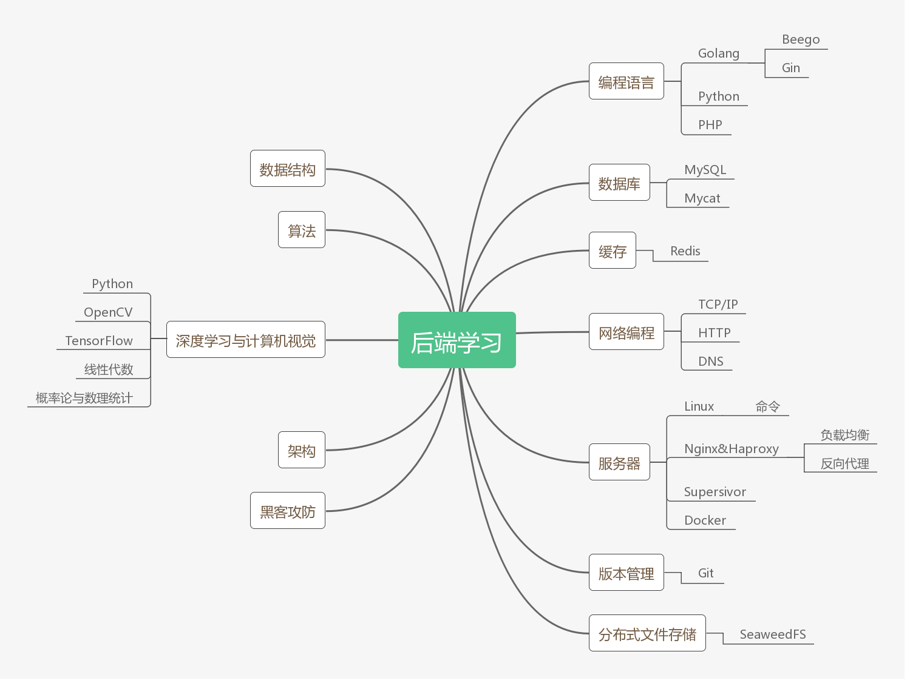

# 后端学习指南

## 思维导图

## 编程语言
- [Golang](introduction/why_write.md)
- [Python](introduction/reader.md)
- [PHP](introduction/reader.md)

## 数据库
- [MySQL](mysql/index.md)

## 缓存
- [Redis]()

## 网络编程

## 服务器

## 版本管理

## 分布式文件存储
